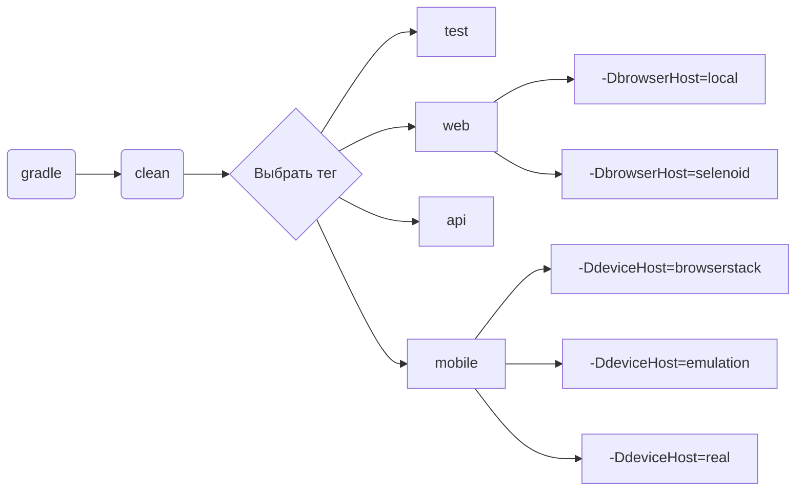

# Проект по автоматизации тестирования для компании [](https://habitica.com)
> Habitica — трекер задач, который совместил философию RPG и GTD(доведение дел до завершения) в своей Web-версии и приложениях для Android и iOS.
---
## :scroll: Содержание:
+ [Особенности проекта](#особенности-проекта)
+ [Используемый стек](#computer-используемый-стек)
+ [Реализованные проверки](#ballot_box_with_check-реализованные-проверки)
+ [Запуск тестов](#запуск-тестов)
    + [Локальный запуск тестов](#локальный-запуск-тестов)
    + [Удаленный запуск тестов на Selenoid и BrowserStack](#удаленный-запуск-тестов-на-Selenoid-и-BrowserStack)
+ [Сборка в Jenkins](#-сборка-в-jenkins)
+ [Интеграция с Allure Report](#-интеграция-с-allure-report)
+ [Интеграция с Allure TestOps](#-интеграция-с-allure-testops)
+ [Интеграция с Jira](#-интеграция-с-jira)
+ [Уведомления в Telegram с использованием бота](#-уведомления-в-telegram-с-использованием-бота)
+ [Видео примера запуска тестов в Selenoid](#-видео-примера-запуска-тестов-в-selenoid)
+ [Видео примера запуска тестов в BrowserStack](#-видео-примера-запуска-тестов-в-browserstack)
---
## Особенности проекта
- Проект состоит из UI-тестов, API и мобильных тестов на Android
- В данном проекте автотесты написаны на языке `Java`
- В качестве сборщика был использован - `Gradle`
- Использованы фреймворки `JUnit 5` и `Selenide`
- Шаблон проектирования `Page Object`
- Использование техноголии `Owner` для придания тестам гибкости и легкости конфигурации
- Возможность запуска тестов: локально, удалённо, по тегам
- Использование `Faker` для генерации данных
- Использование `Lombok` для моделей в API тестах
- Использование собственных расширений:
    - `@WithLogin` для предварительной авторизации
    - `@LoggingExtension` для дополнительного логирования тестов
- При прогоне UI тестов браузер запускается в `Selenoid`
- Возможность запуска проектов с помощью `Jenkins`
- Возможность запуска тестов напрямую из `Allure TestOps`
- Интеграция с `Jira`
- Уведомление о результатах прохождения в `Telegram`
- По итогу прохождения автотестов генерируется `Allure` отчет. Содержание отчета:
    - Шаги теста
    - Скриншот страницы на последнем шаге
    - Исходный код страницы в браузере
    - Логи консоли браузера
    - Видео выполнения автотеста
---
## :computer: Используемый стек
<p align="center">
<a href="https://www.jetbrains.com/idea/"></a> 
<a href="https://www.java.com/"></a>
<a href="https://gradle.org/"></a> 
<a href="https://selenide.org/"></a> 
<a href="https://aerokube.com/selenoid/"></a>
<a href="https://rest-assured.io"></a>
<a href="https://github.com/allure-framework/allure2"></a>
<a href="https://qameta.io"></a>
<a href="https://junit.org/junit5/"></a> 
<a href="https://github.com/"></a> 
<a href="https://www.jenkins.io/"></a> 
<a href="https://telegram.org/"></a>  
<a href="https://app-automate.browserstack.com/"></a>  
<a href="https://developer.android.com/studio"></a>   
<a href="https://appium.io"></a>  
<a href="https://www.atlassian.com/software/jira"></a>  
</p>   

---
## :ballot_box_with_check: Реализованные проверки:

### Web
- [x] Проверка корректной авторизации c помощью имени пользователя
- [x] Проверка корректной авторизации c помощью email
- [x] Проверка действия кнопки перехода к авторизации - "Вход"
- [x] Проверка действия кнопки перехода к регистрации - "Регистрация"
- [x] Проверка перемещения по разделам главной страницы (@ParameterizedTest)
- [x] Проверка быстрого создания задачи на главной странице
- [x] Проверка быстрого создания задачи на главной странице

### Api
- [x] Проверка корректной авторизации
- [x] Проверка невозможности авторизации без пароля
- [x] Проверка успешного получения информации о списках задач
- [x] Проверка создания новой задачи
- [x] Проверка удаления задачи

### Mobile
- [x] Проверка кнопки пропуска приветственного экрана - "skip"
- [x] Проверка действия кнопки перехода к авторизации - "LOGIN"
- [x] Проверка действия кнопки перехода к регистрации - "REGISTER"
---
## Запуск тестов

### Допустимые комбинации


### Локальный запуск тестов
> [!]  
> Для работы со своей учетной записью на https://habitica.com следует отредактировать файл - auth.properties  
> Для работы со своим мобильным устройством - заменить параметры в файле realMobile.properties  
> Для работы с отличным от проектного эмулятором стоит изменить параметры в файле - emulationMobile.properties

Запуск всех тестов
```
gradle clean test -DbrowserHost=local -DdeviceHost=real
```
Запуск Web тестов
```
gradle clean web -DbrowserHost=local
```
> [!]
> Если требуется передать параметры отличные от дефолтных в интерфейсе WebConfig  
> то можно изменить интерфейс, либо передать свои параметры в переменных при запуске тестов  
> Например:
>* <code>baseUrl</code> – URL.
>* <code>browser</code> – браузер, в котором будут выполняться тесты.
>* <code>browserSize</code> – размер окна браузера, в котором будут выполняться тесты.
> ```
>-DbaseUrl=https://habitica.com
>-Dbrowser=chrome
>-DbrowserSize=1920x1080
>```
Запуск API тестов
```
gradle clean api
```
Запуск мобильных тестов на реальном устройстве
```
gradle clean mobile -DdeviceHost=real
```
Запуск мобильных тестов на эмуляторе Android Studio
```
gradle clean mobile -DdeviceHost=emulation
```
> [!] Для работы с реальным или виртуальным мобильным устройством следует ознакомиться с данной инструкцией
> <details>
> <summary>Инструкция</summary>
>
>#### 1. Настроить рабочий стол:
>
> Вариант 1:   
>https://autotest.how/appium-setup-for-local-android-tutorial-md
>
>Вариант 2:   
>Установить android studio https://developer.android.com/studio   
>Прописать настройки:
>
>Параметры Path:
>
>Windows:   
>%ANDROID_HOME%\tools   
>%ANDROID_HOME%\tools\bin   
>%ANDROID_HOME%\platform-tools
>%ANDROID_HOME%\emulator
>
>Одной строкой, можно скопировать и в командной строке прописать:
>```shell
>setx PATH %PATH%;%ANDROID_HOME%\tools;%ANDROID_HOME%\tools\bin;%ANDROID_HOME%\platform-tools;%ANDROID_HOME%\emulator
>```
>
>Mac:  
>export ANDROID_HOME=/Users/stanislav/Library/Android/sdk   
>export PATH=$PATH:$ANDROID_HOME/tools:$ANDROID_HOME/platform-tools   
>source ~/.bash_profile
>- В Android Studio -> SDK Manager скачать 11 андроид (если не скачан по умолчанию)
>- В AVD Manager скачать образ Pixel 4 для 11 андроида (если не скачан по умолчанию)   
   >  -- Запустить эмулятор телефона, опробовать кнопки и функционал
>- Установить node.js - https://nodejs.org/en/download
>- Установить Appium Server https://github.com/appium/appium
>
>Mac:
>```shell
>sudo npm install -g appium@next
>```    
>Windows:
>```shell
>npm install -g appium
>```
>
>- Установить драйвер uiautomator2   
   >  Mac:
>```shell
> sudo appium driver install --source=npm uiautomator2 (если команда не подходит - можно выполнить эту appium driver install uiautomator2)
>```   
>Windows:
> ```shell
 >appium driver install --source=npm uiautomator2 (если команда не подходит - можно выполнить эту appium driver install uiautomator2)
>```  
>
>- Установить Appium Ispector https://github.com/appium/appium-inspector
>- Запустить Appium Server
>```shell
>appium server --base-path /wd/hub
>```
>#### 2. Открыть Appium Inspector
>**Подключить локальное устройство:**   
>Для определения серийного номера устройства
>```shell
>cd C:\Users\{User}\AppData\Local\Android\Sdk\platform-tools
>```
>Затем ввести команду и найти serial_number устройства
>```shell
>adb devices
>```
>В Appium Inspector в теле сессии ввести:
>```shell
>{
>  "platformName": "Android",
>  "appium:automationName": "UiAutomator2",
>  "appium:deviceName": "{serial_number}"
>}
>```
>**Для подключения к эмуляции ввести данные от виртуального устройства**
></details>
### Удаленный запуск тестов на Selenoid и BrowserStack
> [!] В проекте запуск Web тестов на Selenoid и мобильных тестов на BrowserStack установлен поумолчанию
>
> Для работы со своей учетной записью на https://app-automate.browserstack.com следует отредактировать файл - auth.properties.  
> Если требуется изменить устройство следует отредактировать файл - browserstackMobile.properties.

Запуск всех тестов
```
gradle clean test
```
Запуск Web тестов на Selenoid
```
gradle clean web 
```
или
```
gradle clean web -DbrowserHost=selenoid
```
> [!]
> Если требуется передать параметры отличные от дефолтных в интерфейсе WebConfig  
> то можно изменить интерфейс, либо передать свои параметры в переменных при запуске тестов  
> Например:
>* <code>baseUrl</code> – URL.
>* <code>browser</code> – браузер, в котором будут выполняться тесты.
>* <code>browserVersion</code> – версия браузера, в которой будут выполняться тесты.
>* <code>browserSize</code> – размер окна браузера, в котором будут выполняться тесты.
> ```
>-DbaseUrl=https://habitica.com
>-Dbrowser=chrome
>-DbrowserVersion=100
>-DbrowserSize=1920x1080

>```
Запуск мобильных тестов на BrowserStack
```
gradle clean mobile 
```
или
```
gradle clean mobile -DdeviceHost=browserstack
```
---

##  Сборка в [Jenkins](https://jenkins.autotests.cloud/job/27-AnBrain-unit23-Habitica_Tests_Project)

* <code>TASK</code> – название запускаемой задачи. По умолчанию - <code>test</code>.
* <code>BASE_URL</code> – URL. По умолчанию - <code>https://habitica.com</code>.
* <code>BROWSER</code> – браузер, в котором будут выполняться тесты. По умолчанию - <code>chrome</code>.
* <code>BROWSER_VERSION</code> – версия браузера, в которой будут выполняться тесты. По умолчанию - <code>100.0</code>.
* <code>BROWSER_SIZE</code> – размер окна браузера, в котором будут выполняться тесты. По умолчанию - <code>1920x1080</code>.

***Параметры запуска:***
```bash  
clean ${TASK}
-"DbaseUrl=${BASE_URL}"
-"Dbrowser=${BROWSER}"
-"DbrowserSize=${BROWSER_SIZE}"
-"DbrowserVersion=${BROWSER_VERSION}"
```
Для запуска сборки необходимо перейти в раздел <code>Собрать с параметрами</code>, задать параметры и нажать кнопку <code>Собрать</code>.
<p align="center">


</p>
После выполнения сборки, в блоке <code>История сборок</code> напротив номера сборки появятся значек <code>Allure Report</code>, при клике на который откроется страница со сформированным html-отчетом и тестовой документацией соответственно,
а так же появятся значек <code>Allure TestOps</code> при клике на который откроется страница проекта в <code>Allure TestOps</code>.

---
##  Интеграция с [Allure Report](https://jenkins.autotests.cloud/job/27-AnBrain-unit23-Habitica_Tests_Project/6/allure/)
`ALLURE REPORT` - отображает дату и время теста, общее количество запущенных тестов, а также диаграмму с процентом и количеством успешных, упавших и сломавшихся в процессе выполнения тестов  
`TREND` - отображает тенденцию выполнения тестов для всех запусков  
`SUITES` - отображает распределение тестов по сьютам  
`CATEGORIES` - отображает распределение неудачных тестов по типам дефектов

### Диаграмма прохождения тестов

<p align="center">  
  
</p>  

### Развернутый результат прохождения тестов:
1. Общий список автотестов
2. Содержание автотеста
3. Вложения

<p align="center">  
  
</p>

---
##  Интеграция с [Allure TestOps](https://allure.autotests.cloud/project/4348)

### Дашборд

<p align="center">  
  
</p>

### Тест-кейсы

<p align="center">  
  
</p>

### Запуски
<p align="center">  
  
</p>

---
##  Интеграция с [Jira](https://jira.autotests.cloud/browse/HOMEWORK-1304)

### В Jira создана задача
<p align="center">  
  
</p>

### В разделе `Allure:Test Cases` отображаются тест-кейсы
<p align="center">  
  
</p>

### В разделе `Allure:Launches` отображаются запуски прогонов
<p align="center">  
  
</p>

---
##  Уведомления в Telegram с использованием бота

После завершения сборки специальный бот, созданный в <code>Telegram</code>, автоматически обрабатывает и отправляет сообщение с отчетом о прогоне тестов.

<p align="center">

</p>

---
##  Видео примера запуска тестов в Selenoid

В отчетах Allure для каждого теста прикреплен не только скриншот, но и видео прохождения теста
<p align="center">
  
</p>

---

##  Видео примера запуска тестов в BrowserStack

В отчетах Allure для каждого теста прикреплен не только скриншот, но и видео прохождения теста
<p align="center">
  
</p>
