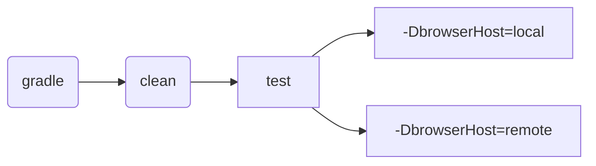

# Проект по автоматизации тестирования для сайта [](https://www.21vek.by/)
> 21vek.by — это крупнейший белорусский онлайн-гипермаркет непродовольственных товаров с огромным выбором товаров.
---
## :scroll: Содержание:
+ [Особенности проекта](#особенности-проекта)
+ [Используемый стек](#computer-используемый-стек)
+ [Реализованные проверки](#ballot_box_with_check-реализованные-проверки)
+ [Запуск тестов](#запуск-тестов)
    + [Локальный запуск тестов](#локальный-запуск-тестов)
    + [Удаленный запуск тестов на Selenoid и BrowserStack](#удаленный-запуск-тестов-на-Selenoid-и-BrowserStack)
+ [Сборка в Jenkins](#-сборка-в-jenkins)
+ [Интеграция с Allure Report](#-интеграция-с-allure-report)
+ [Интеграция с Allure TestOps](#-интеграция-с-allure-testops)
+ [Уведомления в Telegram с использованием бота](#-уведомления-в-telegram-с-использованием-бота)
+ [Видео примера запуска тестов в Selenoid](#-видео-примера-запуска-тестов-в-selenoid)
---
## Особенности проекта
- Проект состоит из UI-тестов.
- В данном проекте автотесты написаны на языке `Java`
- В качестве сборщика был использован - `Gradle`
- Использованы фреймворки `JUnit 5` и `Selenide`
- Шаблон проектирования `Page Object`
- Использование техноголии `Owner` для придания тестам гибкости и легкости конфигурации
- Возможность запуска тестов: локально, удалённо, по тегам
- Использование `Faker` для генерации данных
- При прогоне UI тестов браузер запускается в `Selenoid`
- Возможность запуска проектов с помощью `Jenkins`
- Возможность запуска тестов напрямую из `Allure TestOps`
- Уведомление о результатах прохождения в `Telegram`
- По итогу прохождения автотестов генерируется `Allure` отчет. Содержание отчета:
    - Шаги теста
    - Скриншот страницы на последнем шаге
    - Исходный код страницы в браузере
    - Логи консоли браузера
    - Видео выполнения автотеста
---

## 🔨 Технологии и инструменты:

<p align="left">
<a href="https://allurereport.org/"></a>
<a href="https://gradle.org/"></a>
<a href="https://developer.android.com/"></a>
<a href="https://www.java.com/"></a>
<a href="https://www.jenkins.io/"></a>
<a href="https://junit.org/junit5/"></a>
<a href="https://selenide.org/"></a>
<a href="https://www.browserstack.com/"></a>
<a href="https://appium.io/"></a>
<a href="https://qameta.io/"></a>
</p>  

---
## :ballot_box_with_check: Реализованные проверки:

### Web
- [x] Тест на добавление товара в корзину
- [x] Тест на добавление товара в избранное
- [x] Негативный тест на авторизацию без email
- [x] Негативный тест на авторизацию без пароля
- [x] Тест на удаление товара из избранное
- [x] Тест на удаление товара из корзины
- [x] Тест кликабельности котегорий главного меню (@ParameterizedTest)
---
## Запуск тестов

### Допустимые комбинации


### Локальный запуск тестов

Запуск всех тестов
```
gradle clean test -DbrowserHost=local
```
> [!]
> Если требуется передать параметры отличные от дефолтных в интерфейсе LocalConfig 
> то нужно передать свои параметры в переменных при запуске тестов  
> Например:
>* <code>baseUrl</code> – URL.
>* <code>browser</code> – браузер, в котором будут выполняться тесты.
>* <code>browserSize</code> – размер окна браузера, в котором будут выполняться тесты.
> ```
>-DbaseUrl=https://www.21vek.by/
>-Dbrowser=chrome
>-DbrowserSize=1920x1080
>```
> 
---

##  Сборка в [Jenkins](https://jenkins.autotests.cloud/job/27-AnBrain-unit23-Habitica_Tests_Project)

* <code>TASK</code> – название запускаемой задачи. По умолчанию - <code>test</code>.
* <code>BASE_URL</code> – URL. По умолчанию - <code>https://habitica.com</code>.
* <code>BROWSER</code> – браузер, в котором будут выполняться тесты. По умолчанию - <code>chrome</code>.
* <code>BROWSER_VERSION</code> – версия браузера, в которой будут выполняться тесты. По умолчанию - <code>100.0</code>.
* <code>BROWSER_SIZE</code> – размер окна браузера, в котором будут выполняться тесты. По умолчанию - <code>1920x1080</code>.

***Параметры запуска:***
```bash  
clean ${TASK}
-"DbaseUrl=${BASE_URL}"
-"Dbrowser=${BROWSER}"
-"DbrowserSize=${BROWSER_SIZE}"
-"DbrowserVersion=${BROWSER_VERSION}"
```
Для запуска сборки необходимо перейти в раздел <code>Собрать с параметрами</code>, задать параметры и нажать кнопку <code>Собрать</code>.
<p align="center">


</p>
После выполнения сборки, в блоке <code>История сборок</code> напротив номера сборки появятся значек <code>Allure Report</code>, при клике на который откроется страница со сформированным html-отчетом и тестовой документацией соответственно,
а так же появятся значек <code>Allure TestOps</code> при клике на который откроется страница проекта в <code>Allure TestOps</code>.

---
##  Интеграция с [Allure Report](https://jenkins.autotests.cloud/job/27-AnBrain-unit23-Habitica_Tests_Project/6/allure/)
`ALLURE REPORT` - отображает дату и время теста, общее количество запущенных тестов, а также диаграмму с процентом и количеством успешных, упавших и сломавшихся в процессе выполнения тестов  
`TREND` - отображает тенденцию выполнения тестов для всех запусков  
`SUITES` - отображает распределение тестов по сьютам  
`CATEGORIES` - отображает распределение неудачных тестов по типам дефектов

### Диаграмма прохождения тестов

<p align="center">  
  
</p>  

### Развернутый результат прохождения тестов:
1. Общий список автотестов
2. Содержание автотеста
3. Вложения

<p align="center">  
  
</p>

---
##  Интеграция с [Allure TestOps](https://allure.autotests.cloud/project/4348)

### Дашборд

<p align="center">  
  
</p>

### Тест-кейсы

<p align="center">  
  
</p>

### Запуски
<p align="center">  
  
</p>

---
##  Интеграция с [Jira](https://jira.autotests.cloud/browse/HOMEWORK-1304)

### В Jira создана задача
<p align="center">  
  
</p>

### В разделе `Allure:Test Cases` отображаются тест-кейсы
<p align="center">  
  
</p>

### В разделе `Allure:Launches` отображаются запуски прогонов
<p align="center">  
  
</p>

---
##  Уведомления в Telegram с использованием бота

После завершения сборки специальный бот, созданный в <code>Telegram</code>, автоматически обрабатывает и отправляет сообщение с отчетом о прогоне тестов.

<p align="center">

</p>

---
##  Видео примера запуска тестов в Selenoid

В отчетах Allure для каждого теста прикреплен не только скриншот, но и видео прохождения теста
<p align="center">
  
</p>

---

##  Видео примера запуска тестов в BrowserStack

В отчетах Allure для каждого теста прикреплен не только скриншот, но и видео прохождения теста
<p align="center">
  
</p>
